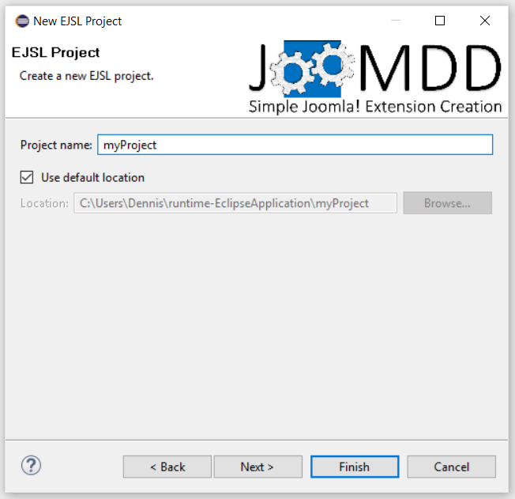
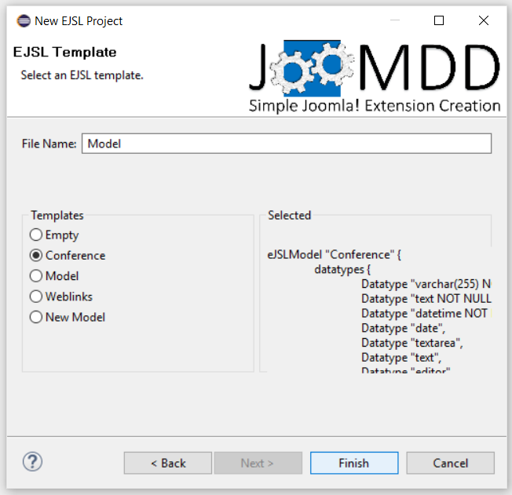
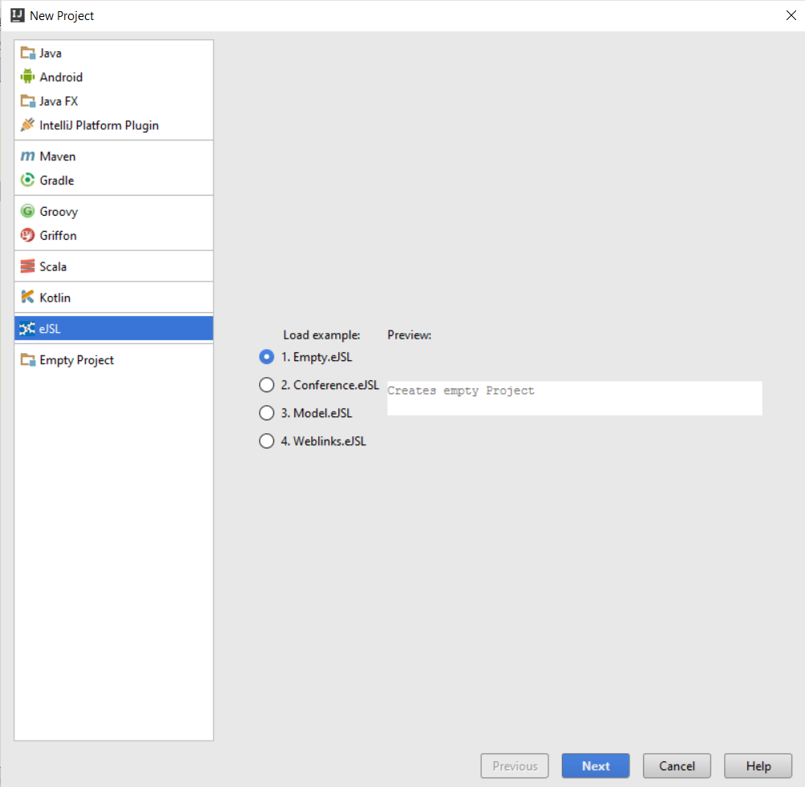

**JooMDD** provides a set of plugins for a model-driven development of Joomla! extension 
packages. 
The current version of JooMDD can be used within ***Eclipse***, 
***IntelliJ IDEA***, and ***PhpStorm***.

In addition, we provide **jext2eJSL** to create eJSL-based models based on existing Joomla 3.x extension packages.
We are currently working on the documentation of jext2eJSL. If you are interested in using the tool, see the current (german) 
documentation [here](https://wiki.thm.de/Reverse-Engineering_(Joomla-Code_zu_eJSL-Instanzmodell)).

***
## Installation of JooMDD ##
Please follow this installation guide to use JooMDD within Eclipse, IntelliJ, and PhpStorm. 

### Eclipse ###
Install the JooMDD tools through the use of the following update site within the Eclipse update manager. Supported versions are:
*Kepler*, *Luna*, *Mars*, and *Neon*. 

JooMDD update site (Eclipse): <https://raw.githubusercontent.com/icampus/JooMDD/master/Eclipse/JooMDDUpdateSite/site.xml>
  
### IntelliJ IDEA ###
Install the JooMDD tools through the use of the following update site within IntelliJ's plugin manager. The currently supported 
(tested) version is IntelliJ IDEA 16. Please feel free to try JooMDD within other IntelliJ versions. As a precondition you have to install
the Xtext IDEA Core from the IntelliJ repositories.
#### Installation steps: ####
1. Install Xtext IDEA Core from the repositories of IntelliJ. (In IntelliJ go to: File/Settings/Plugins/Browse Repositories search: "Xtext 
Idea Core" and install the plugin).
2. Install the JooMDD plugin in the same way via the following JooMDD update site (alternatively you can download the plugins from this 
repository and install them manually into your IDE.):
JooMDD update site (IntelliJ IDEA): <https://raw.githubusercontent.com/icampus/JooMDD/master/IntelliJ/ideaRepository/updatePlugins.xml>.
3. Restart IntelliJ.
  

### PhpStorm 10###
Due to the fact, that the PhpStorm support is in a kind of beta state, you need some more effort for the installation. But don't 
be scared, it's just copy&paste of some files ;-). Please ensure, that you have the latest version of PhpStorm installed. We tested 
the following instructions with version 10.0.3.
#### Installation steps: ####
1. Download *[org.eclipse.xtext.idea-2.9.2.zip (Xtext IDEA Core)](https://github.com/icampus/JooMDD/raw/master/PHPStorm/xtext_plugin/PhpStorm10/org.eclipse.xtext.idea-2.9.2.zip)* 
and *[IntelliJdepencies10.0.3.jar](https://github.com/icampus/JooMDD/raw/master/PHPStorm/xtext_plugin/PhpStorm10/IntelliJdepencies10.0.3.jar)* from our repository 
(the files are within the *PhpStorm* folder).
2. Copy *IntelliJdepencies10.0.3.jar* into your PhpStorm installation folder: *\<PhpStorm installation\>\lib\*
3. Install *Xtext IDEA Core* in PhpStorm via *"Install plugin from disk..."*.
4. Install the JooMDD plugin from our repository using the following JooMDD update site (alternatively you can download the plugins from 
this repository and install them manually into your IDE):
JooMDD update site (PhpStorm): <https://raw.githubusercontent.com/icampus/JooMDD/master/PHPStorm/ideaRepository/updatePlugins.xml>.
5. Restart PhpStorm.
  

### PhpStorm 16###
We tested the following instructions with version 16.2.
#### Installation steps: ####
1. Download *[xtext.idea-2.9.2withdependencies2016.1.2-.zip (Xtext IDEA Core with IntelliJ dependencies)](https://github.com/icampus/JooMDD/raw/master/PHPStorm/xtext_plugin/PhpStorm16/xtext.idea-2.9.2withdependencies2016.1.2-.zip)* from our repository (the files are within the *PhpStorm* folder).
3. Install *Xtext IDEA Core* in PhpStorm via *"Install plugin from disk..."*.
4. Install the JooMDD plugin from our repository using the following JooMDD update site (alternatively you can download the plugins from this repository and install them manually into your IDE):
JooMDD update site (PhpStorm): <https://raw.githubusercontent.com/icampus/JooMDD/master/PHPStorm/ideaRepository/updatePlugins.xml>.
5. Restart PhpStorm.

***
## Getting Started ##
### The eJSL language###
 
 
The **eJSL** plugin can be used to create extensions for the Joomla CMS in a model-driven way. 
Through the creation of eJSL-specific models a tremendous amount of code becomes generated automatically. 
eJSL supports the definition of several Joomla extension types like components, modules, plugins, and 
libraries. The generated code can be used within web pages, running on [Joomla 3.x](https://www.joomla.org/3). 

Please make sure, that you've installed the eJSL part of JooMDD to follow the next steps.
### 1. Create a new eJSL project ###
There are two ways to create an eJSL project:

#### Manual project creation (works for Eclipse, IntelliJ IDEA, and PhpStorm): ####
1. Create a new project of any type (e.g. a general, Java, or PHP project)
2. Create a new file of any name with the ending .eJSL (e.g. *model.eJSL*)
3. Start creating your model containing entities, pages, and extensions

#### Using the eJSL Project Wizard: ####
Instead of creating an eJSL project manually, you can get started easier, using the eJSL project wizard. 

##### Eclipse #####
Create a new project and within the "new Project" dialogue open the folder eJSL Wizard. 

Within this folder you should see *"EJSL Project"*. Give your project a name and select a model example template.
Through a click on the Finish-Button the required project structure becomes generated containing source folders 
for your models (*src*) and for the code generated based on your models (*src-gen*). The chosen example model 
is created within the src folder which can be used for a straightforward introduction.

##### IntelliJ #####
Create a new project and within the "new Project" dialogue click on the *eJSL* section. 

Select a model example template and subsequently give you project a name.
Through a click on the Finish-Button the required project structure becomes generated containing source folders 
for your models (*src*) and for the code generated based on your models (*src-gen*). The chosen example model 
is created within the src folder which can be used for a straightforward introduction.

##### PhpStorm #####
Create a new project and within the "new Project" dialogue click on the *eJSL* section.

Select a model example template and subsequently give you project a name.
Through a click on the create-Button the required project structure becomes generated containing source folders 
for your models (*src*) and for the code generated based on your models (*src-gen*). The chosen example model 
is created within the src folder which can be used for a straightforward introduction.

### 2. Create a model ###
eJSL allows you the definition of different parts of a Joomla extension. Starting with the definition 
of a data structure (***entities***) on to its presentation (***pages***) up to the specification of 
Joomla-specific ***extensions***.

While using the text-based editor you get support by the code completion typing ***Ctrl + Space***.

For an easier start we recommend the use of the example instances, provided by the project wizards.  

### 3. Code generation ###
When you save your model, the code generator creates your modelled Joomla extensions within the project's 
src-gen folder. The extensions are installable within Joomla 3.x web sites and don't need any additional 
line of code. However, if you know what you do, you can extend the generated code through individual features. 
But beware: All the code within the src-gen folder becomes COMPLETELY overwritten, when you change your model 
and save it. Therefore we recommend to copy generated extensions to another folder within your project, where 
you can extend them without loosing them after a new code generation. Another and cleaner option is using a 
versioning tool like git to store your individual added code.

**Note:** Our tools are completly prototypical and we are currently working on the generator structure.

***
## Copyright ##
Copyright (C) 2013 - 2016, [iCampus](http://icampus.thm.de) - [Technische Hochschule Mittelhessen](http://www.thm.de). 
All rights reserved.
This project is distributed under the GPL (GNU General Public License) version 2. For further information see 
the [License details](https://git.thm.de/JooMDD/joomdd_repo/blob/master/LICENSE).

***
Please feel free to [contact](icampu@lists.thm.de) us, if you find some bugs or if you like to contribute to the project.