# JooMDD Development Guide #

## Setup Development Environment ##

TODO: Window -> Preferences -> General -> Workspace: Text file encoding: UTF-8; New text file line delimiter: Unix

1. 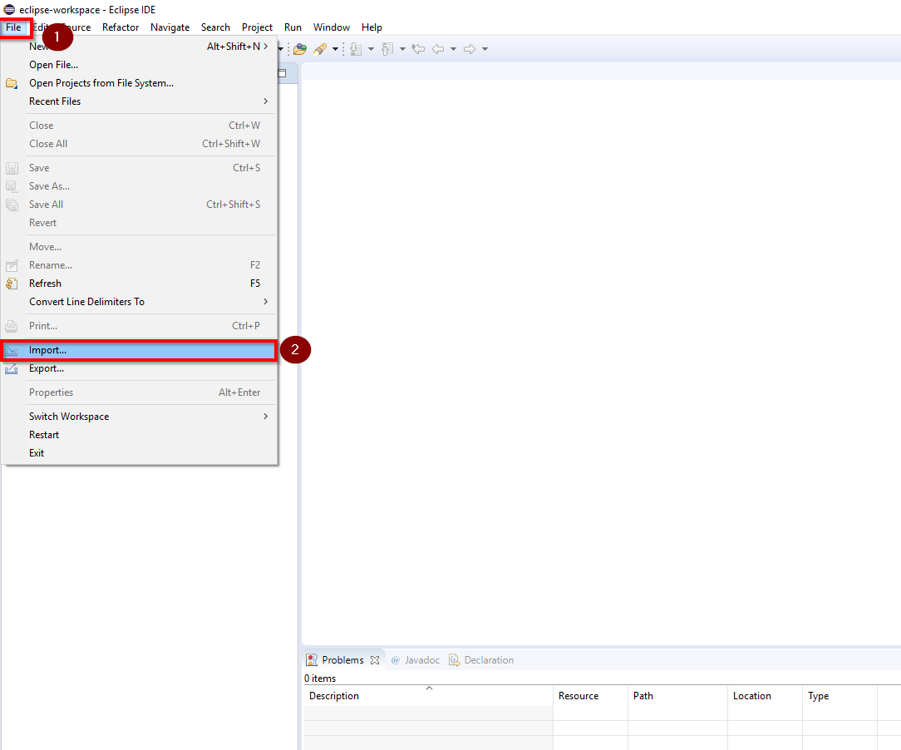

2. 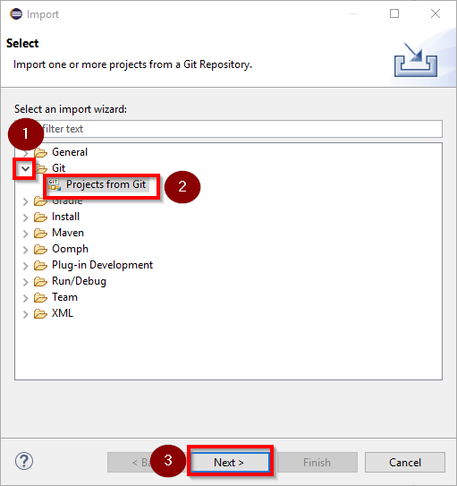

3. 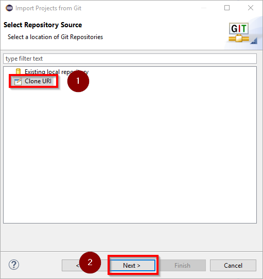

4. 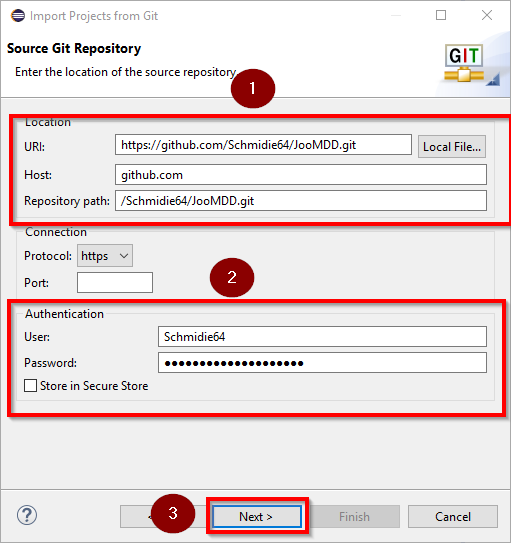

5. 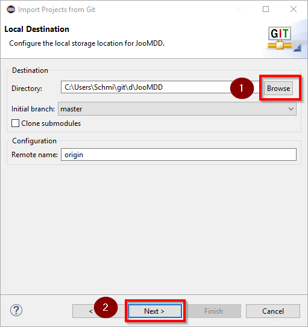

6. 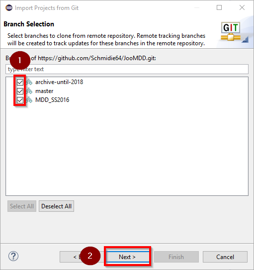

7. 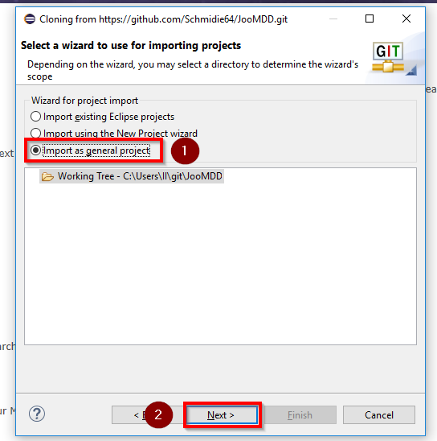
 
8. 

9. 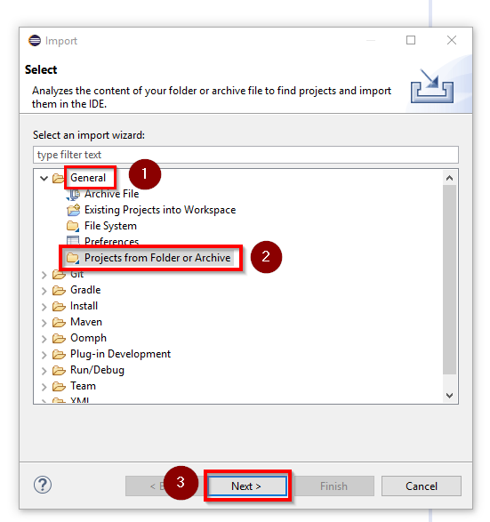

10. 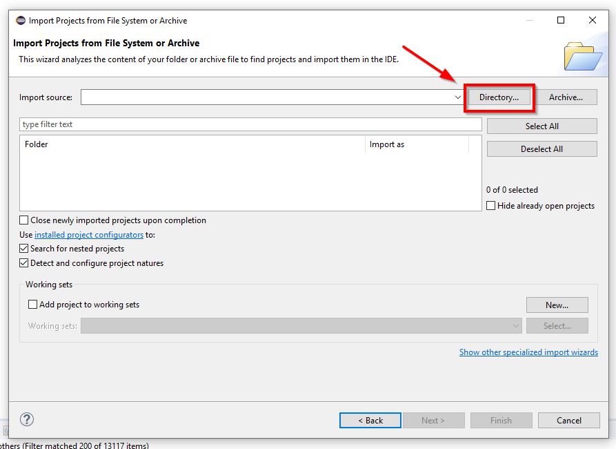

11. 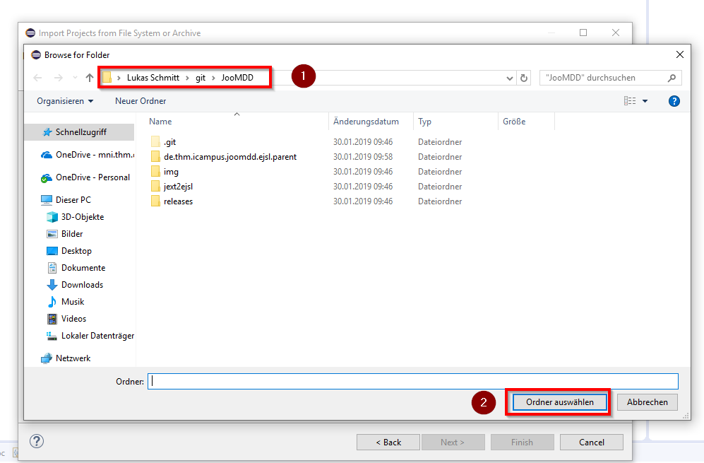

12. 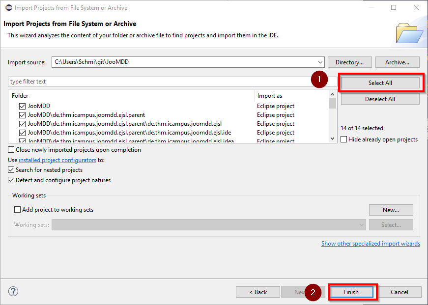

##eJSL ##
### Language Development ###
The eJSL Language can be used to implement both a CMS ***core*** and CMS ***extensions***. Both consist of two main parts (features): ***entities*** and ***pages***. 
The core part should also consist of the feature section. Which should be used to model the backend and the frontend of a CMS.
Extensions, which can be modelled are currently specific for Joomla (Component, Module, Plugin, Template, Library). In further versions Component, Module and Plugin 
will be abstracted and clustered to Plugin.
 

	EJSLModel returns EJSLModel:
		{EJSLModel}
		'eJSLModel'	name=STRING
		'{'
			('eJSL part:' ejslPart=EJSLPart)
		'}';
		
	CMSCore:
		{CMSCore}
		'CMS Core' '{'
			('datatypes' '{' datatypes+=Datatype ( "," datatypes+=Datatype)* '}')?
			('globalparameters' '{' (globalparameters+=Parameter)* '}')?
			('parametergroups' '{' (parametergroups+=ParameterGroup)* '}')?
			feature = Feature
		//	(coreFeature += coreFeature*) // for further implementation of core features
		'}'
	;
	
	coreFeature:
		{coreFeature}
		'coreFeature'
	;
	
	CMSExtension:
		{CMSExtension}
			'CMS Extension' '{'
				('datatypes' '{' datatypes+=Datatype ( "," datatypes+=Datatype)* '}')?
				('globalparameters' '{' (globalparameters+=Parameter)* '}')?
				('parametergroups' '{' (parametergroups+=ParameterGroup)* '}')?
				features = Feature
				('extensions' '{' (extensions+=Extension)* '}')?
		'}'
	;
	
	Feature:
		{Feature}
		('entitypackages' '{' (entitypackages+=Entitypackage)* '}')?
		('entities' '{' (entities+=Entity)* '}')?
		('pages' '{' (pages+=Page)* '}')?
		('sections' '{' (sections+=Section)+ '}')?
	;

### Generator Development ###
#### Monolithic vs dynamic generator structure ####
The generator structure consists of a platform-independent and a platform-specific part. The platform-independent part 
extends the generated API for the language by additional domain-specific functionality, whereas the platform-specific part 
contains the generator template for the platform-specific code generation.

<image of the package structure>

#### Ressource Transformator ####
The **Ressource Transformator** (RT) extends any eJSL instance by missing implicit options to ensure a full instance model. 
It uses an ressource (instance model) as input and returns a full instance model as ressource, which can e.g. be used by a
generator within Xtend generator templates.

The following example illustrates how the RT works:

<image of an RT example>

### Plugin Development (Editor) ###
Within the structure of the JooMDD project, a set of installable plugins for the following IDEs should always be provided: 
*Eclipse*, *IntelliJ IDEA*, and *PHPStorm*. 
#### Eclipse ####

##### Textual Editor #####
###### Formatter ######
###### Validator ######
##### Project Wizard #####
###### Wizard ######
The plugin contains a wizard to create a new eJSL project. It's launched by the extension *org.eclipse.ui.newWizards* where it is configured to create a new project, so it shows up when *New > Project...* is clicked in Eclipse.
The configured wizard class should extend *org.eclipse.jface.wizard.Wizard* and implement *org.eclipse.ui.INewWizard*. Abstract method performFinish() and empty method addPages() are overrided, while addPages() initializes and adds the wizard's pages. The method performFinish() is called, when a user clicks Finish in the wizard. The behaviour of this method is basically copied from *org.eclipse.ui.wizards.newresource.BasicNewProjectResourceWizard* with added ability to copy content from a selected Template to a file in the newly created project. It doen't extend *BasicNewProjectResourceWizard* because it is initialized with two pages to create a new project which is not needed in this case.
###### TemplateSelectionPage ######
This page lists available example instances which are loaded and provided by the static method *loadTemplates()* inside *de.thm.icampus.joomdd.ejsl.ui.wizard.TemplateXMLLoader*.
##### File Wizard #####
The plugin contains a wizard to create a new eJSL file. It's launched by the extension *org.eclipse.ui.newWizards* where it is configured not to create a new project, so it doesn't show up when *New > Project...* is clicked in Eclipse.
In this case the wizard class extends *org.eclipse.ui.wizards.newresource.BasicNewFileResourceWizard* and implements *org.eclipse.ui.INewWizard*. Method *addPages()* is overrided to add a *TemplateSelectionPage* (see above). Filename textfield is disabled by a flag, since filename is managed by the first page. Method *performFinish()* is overrided to additionally copy a template file's content to the new file.
##### eJSL Perspective #####
The plugin contains a perspective with toolbar shortcuts for the Project Wizard and File Wizard. It's registered in the extension *org.eclipse.ui.perspectives* and built by the class *de.thm.icampus.joomdd.ejsl.ui.eJSLPerspectiveFactory*.
###### Project Wizard under PHPStorm ######

##### (De-)Serializer Handlers #####
The Eclipse editor provides an extension to (de-)serialize *eJSL-instances* to/from *xmi-files*. This is done by two 
handler classes (*DeserializationHandler.java* and *SerializationHandler.java*) and the following extension point (under the respective comments) in
the *plugin.xml* of the *de.thm.icampus.joomdd.ejsl.ui plugin*:

	  <!-- XMI Serialization -->  
	  ... all the serialization code
	  <!-- XMI Deserialization -->
	  ... all the deserialization code
	  <!-- (De-)Serialization Context Menu -->
	  ... code for the context menu
*Attention:* The context menu is only available within the ***Java perspective***.

#### IntelliJ and PHPStorm ####
##### Versioning #####
Change the versions within *<Path to Git Repository>\joomdd_repo\development\de.thm.icampus.joomdd.ejsl.parent\de.thm.icampus.joomdd.ejsl.idea\build.gradle*.
##### Textual Editor #####
##### Plugin-Build #####
*	To create an Xtext Project you need the 3 Plugins (Xtend Support, Xtext and Xtext IDEA Core).

*	You can create eJSL plugins for IntelliJ (Gradle: Path= *.parent/*.idea/Task/build/ideaZip) 
The created *.zip is in *.idea/build/distributions/

###### PHPStorm only ######

*	for PhpStorm compatibility the "projectfile".iml is in the folder .idea and not visible in the ide.

*	The Xtext plugin (Version 2.9.2) has a changed plugin.xml the dependency "JUnit" is changed to "com.intellij.modules.lang"
Installation (user):
you need to install Xtext IDEA Core Plugin via Plugin manager and the eJSL Plugin from ...

*	For PhpStorm you must change the plugin.xml (Add <depends>com.intellij.modules.lang</depends>)
Infomation:
in the plugin.xml you can change all Meta-Inf like: description, Plugin version, Plugin name ...

###### Project Wizard ######

*	If you want to add an example just copy it into "resources/eJSLexamples/". The Wizard shows all files in this folder.
*	To add a preview just add it to "resources/previews/ with the same name as the example.

*	If you want to change the description, version ... go to the plugin.xml
*	If you want to export the plugin go to Path: C:\Users\"user"\ .IdeaIC15\system\plugins-sandbox\plugins\ .
Compress the ProjectWizard-folder into a zip file. Now you can install the .zip via install plugin from disk...

*   Merge Plugin with eJSL:
you need both plugins as zip files (...eJSL.idea.zip and ProjectWizard.zip).
copy ProjectWizard.zip\ProjectWizard\classes to eJSL.idea. The dependencies in the plugin.xml file are automatically 
generated.

* **Imprtant:** Change url in updatePlugins.xml to github url!

* For PhpStorm, just copy this IntelliJ plugin and remove the comment around *\<depends\>com.jetbrains.php\</depends\>*.

###### Project Wizard under PHPStorm ######

*	If you want to release the plugin for PHPStorm you have to make following ajustments to your IntelliJ installation
*   Under File|Project Structure|Libaries use the Add-Button to add php-openapi.jar and php.jar located under your_installation_of_PHPStorm/plugins/php/lib
*   Change under Modules|Dependencies Scope to Provided
*   Add the following dependencies to you plugin.xml
<depends>com.jetbrains.php</depends>
<depends>com.intellij.modules.platform</depends>
In this repo they are already added. Please Note that the first dependency has to be deleted if you want the same plugin on IntelliJ

##### Generator inclusion #####

###### Prepare PHPStorm (only first time): ######
*	Copy IntelliJdepencies.jar into path: PHPStorm installation\lib\  .
*	IntelliJdepencies.jar contains idea.jar and some files from openapi.jar. (IntelliJ Version 15.0.2)
Care that cou do not overwrite files that exists in the current openapi.jar. Doubled classes cause a startup error in PHPStorm
It is possible that an update crash the Xtext plugins.
*	Now install the two downloaded plugins (Xtext and EJSL) via "Install plugin from disk ..." (Menu: File/Settings/Plugins/).

###### Add the language and the generator to your Project: ######
*	Now you must configure the plugin via the project file (the project file is in the work directory of the project in the folder .idea\"ProjectName".iml).
Note: This is automatically done through the Project wizard. If you don't use it, you have to do this by hand.

Example for adding the configuration in the project file:

    <component name="FacetManager">
      <facet type="de.thm.icampus.ejsl.EJSL" name="EJSL">
        <configuration>
          <option name="activated" value="true" />
          <option name="createDirectory" value="true" />
          <option name="outputDirectory" value="src-gen" />
          <option name="overwriteExisting" value="true" />
          <option name="testOutputDirectory" value="src-gen" />
        </configuration>
      </facet>
    </component>

*    To use the language you must create a folder in the project and mark it as "Sources Root".

### Instances ###
To ensure a simple usage, we created some example instances, which can be used as templates for own eJSL instances.
#### Simple Default ####
#### Complex Default ####
#### Weblinks ####
#### Conference ####

***
## Copyright ##
Copyright (C) 2013 - 2016, [iCampus](http://icampus.thm.de) - [Technische Hochschule Mittelhessen](http://www.thm.de). 
All rights reserved.
This project is distributed under the GPL (GNU General Public License) version 2. For further information see 
the [License details](https://git.thm.de/JooMDD/joomdd_repo/blob/master/LICENSE).

***
Please feel free to [contact](icampu@lists.thm.de) us, if you find some bugs or if you like to contribute to the project.
