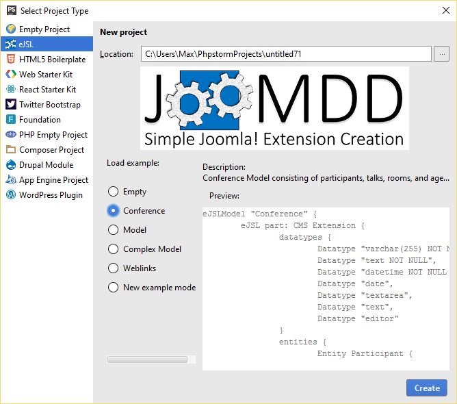

# Getting Started with the IDE Plugins #

- [Getting Started with the IDE Plugins](#getting-started-with-the-ide-plugins)
  - [0. The eJSL language](#0-the-ejsl-language)
  - [1. Create a new eJSL project](#1-create-a-new-ejsl-project)
    - [1. Manual project creation (works for Eclipse, IntelliJ IDEA, and PhpStorm):](#1-manual-project-creation-works-for-eclipse-intellij-idea-and-phpstorm)
    - [2. Using the eJSL Project Wizard:](#2-using-the-ejsl-project-wizard)
      - [Eclipse](#eclipse)
      - [PhpStorm](#phpstorm)
      - [IntelliJ](#intellij)
  - [2. Modelling](#2-modelling)
  - [3. Code generation](#3-code-generation)
  - [4. Reverse Engineering](#4-reverse-engineering)

## 0. The eJSL language ##
 
 
The **eJSL** language is the key component of the JooMDD infrastructure. It can be used to create semantic extension models for the Joomla CMS which can be used e.g. for automatic code generation.

eJSL supports the definition of several Joomla extension types like components, modules, plugins, and libraries.   &rarr;  [eJSL Language Guide](eJSLGuide.md) 

## 1. Create a new eJSL project ##
In this section, we explain how you can create a new eJSL project by hand and by using our integrated project wizards within the Eclipse, PhpStorm, and ItelliJ IDEs.

**Please make sure, that you've installed the JooMDD plugin first to follow the next steps.**
 
&rarr; [How to install the JooMDD IDE plugins](InstallationGuide.md)

### 1. Manual project creation (works for Eclipse, IntelliJ IDEA, and PhpStorm): ###
1. Create a new project of any type (e.g. a general, Java, or PHP project)
2. Add a `src-gen` folder and place a `generator.properties` file within this folder. 
3. Open the `generator.properties` file and insert the path to your output folder (please use `"\\"` as directory separator in your path):   `outputFolder=<Path to your project>\\src-gen`
4. Create a new file of any name with the ending .eJSL (e.g. *model.eJSL*) in the `src` folder

### 2. Using the eJSL Project Wizard: ###
Instead of creating an eJSL project manually, you can get started easier by using the eJSL project wizard. So, the project structure containing the `src-gen` folder and `generator.properties` file will be created automatically. In addition you can use the project wizards to create example models which are helpful to understand the eJSL language.

#### Eclipse ####
Create a new project and within the "new Project" dialogue open the folder eJSL Wizard. 

Within this folder you should see *"EJSL Project"*. Give your project a name and select a model example template.
Through a click on the Finish-Button the required project structure becomes generated containing source folders 
for your models (*src*) and for the code generated based on your models (*src-gen*). The chosen example model 
is created within the src folder which can be used for a straightforward introduction.

#### PhpStorm ####
Create a new project and within the "new Project" dialogue click on the *eJSL* section.

Select a model example template and subsequently give you project a name.
Through a click on the create-Button the required project structure becomes generated containing source folders 
for your models (*src*) and for the code generated based on your models (*src-gen*). The chosen example model 
is created within the src folder which can be used for a straightforward introduction.

#### IntelliJ ####
Create a new project and within the "new Project" dialogue click on the *eJSL* section. 

Select a model example template and subsequently give you project a name.
Through a click on the Finish-Button the required project structure becomes generated containing source folders 
for your models (*src*) and for the code generated based on your models (*src-gen*). The chosen example model 
is created within the src folder which can be used for a straightforward introduction.

## 2. Modelling ##
eJSL allows you the definition of different parts of a Joomla extension. Starting with the definition of a data structure (`entities`) on to its presentation (`pages`) up to the specification of Joomla-specific `extensions`.

For an easier start we recommend the use of the example instances, provided by the project wizards.  

While using the text-based editor you get support by the code completion typing <kbd>Ctrl + Space</kbd>. In addition, the editor supports you during modelling with live validation and syntax highlighting.

To do: Image of Text editor

Please visit the [eJSL language guide](eJSLGuide.md) for an overview of the language and how to use it for extension modelling. 

## 3. Code generation ##
When you save your model, the code generator creates your modelled Joomla extensions within the project's `src-gen` folder. The extensions are installable within **Joomla 3.x** web sites and don't need any additional line of code. However, if you know what you do, you can extend the generated code through individual features. 

**Caution**: All the code within the `src-gen` folder becomes **completely overwritten**, when you change your model and save it. Therefore, we recommend to copy generated extensions to another folder within your project, where you can extend them without loosing them after a new code generation. Another and cleaner option is using a 
versioning tool like git to store your individual added code.

The generated code is split into two parts.  To do: Further explanation.

## 4. Reverse Engineering ##
In addition, we provide **jext2eJSL** to create eJSL-based models based on existing Joomla 3.x extension packages.
We are currently working on the documentation of jext2eJSL. If you are interested in using the tool, see the current (german) 
documentation [here](https://wiki.thm.de/Reverse-Engineering_(Joomla-Code_zu_eJSL-Instanzmodell)).
Instead of executing the .jar file and using the GUI it is also possible to execute the application via CLI using the following arguments: 
**-m &lt;path to manifest file&gt; -o &lt;output path&gt; -no-gui**