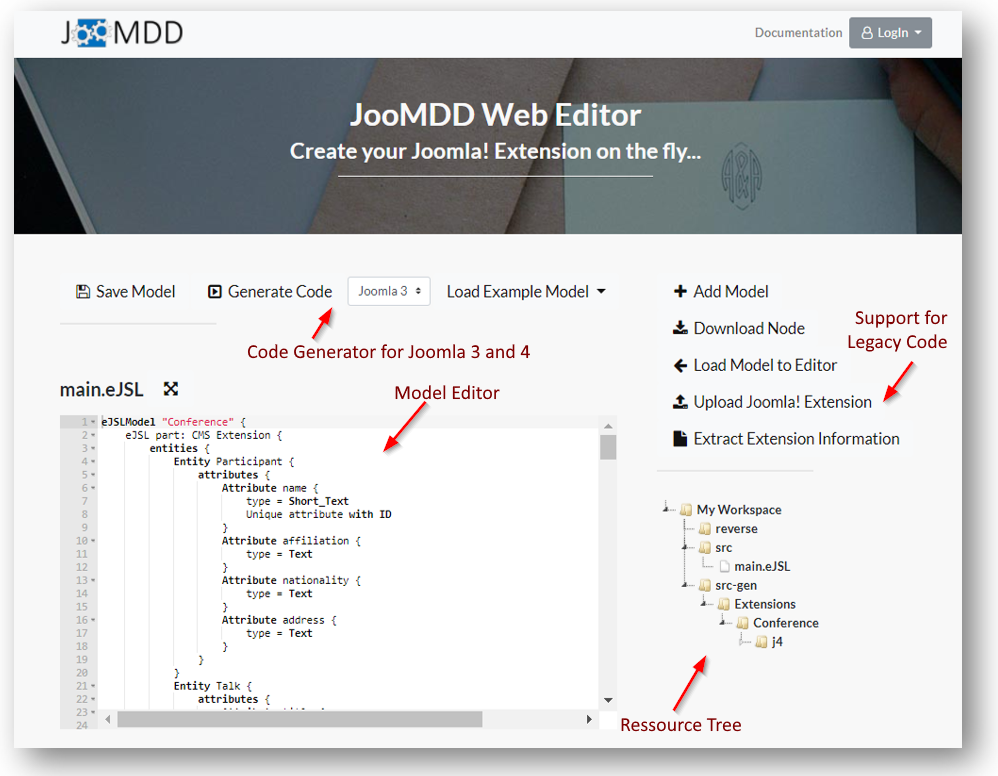
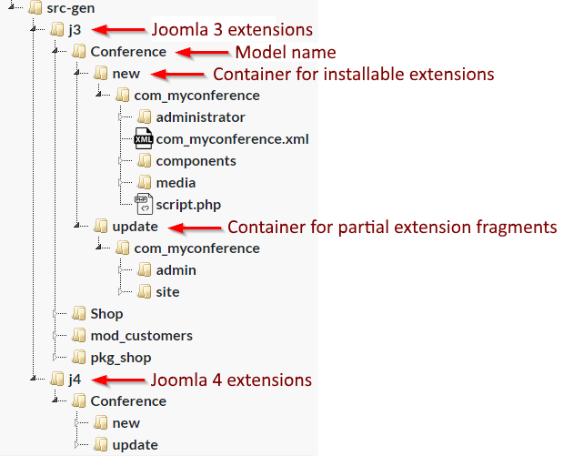
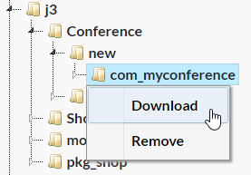
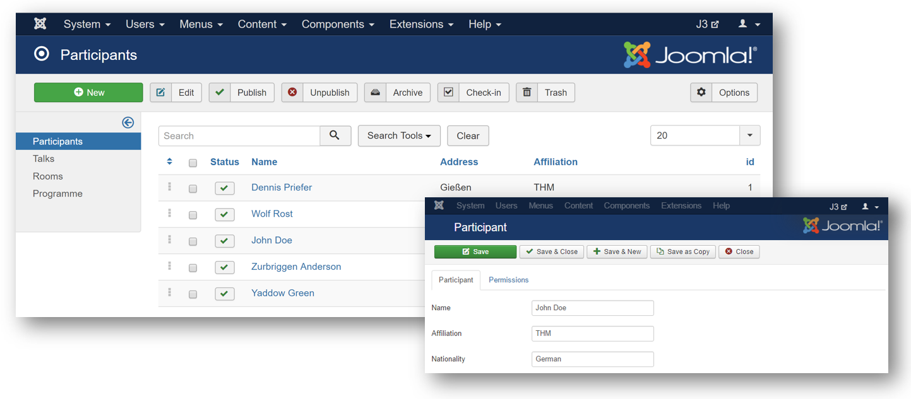

# Getting Started with the Web Editor #

Contents:
- [Getting Started with the Web Editor](#getting-started-with-the-web-editor)
  - [The eJSL language](#the-ejsl-language)
  - [Become familiar with the editor](#become-familiar-with-the-editor)
  - [Create a conference component](#create-a-conference-component)
    - [1. Load the conference example model](#1-load-the-conference-example-model)
    - [2. Save the model](#2-save-the-model)
    - [3. Select Joomla 3 as target platform](#3-select-joomla-3-as-target-platform)
    - [4. Generate the conference component](#4-generate-the-conference-component)
    - [5. Download the generated component as installable package](#5-download-the-generated-component-as-installable-package)
  - [Create a module for an existing component](#create-a-module-for-an-existing-component)
    - [1. Upload of an extension package](#1-upload-of-an-extension-package)
    - [2. Model extraction](#2-model-extraction)
    - [3. Augmentation of the legacy model](#3-augmentation-of-the-legacy-model)
    - [4. Augmentation of the legacy model](#4-augmentation-of-the-legacy-model)
    - [5. Generation of the new module](#5-generation-of-the-new-module)

## The eJSL language ##
 
 
The **eJSL** language is the key component of the JooMDD infrastructure. It can be used to create semantic extension models for the Joomla CMS which can be used e.g. for automatic code generation.

eJSL supports the definition of several Joomla extension types like components, modules, plugins, and libraries. Please visit the [eJSL language guide](eJSLGuide.md) for an overview of the language and how to use it for extension modelling. 

##  Become familiar with the editor ##
Go to: https://icampus.thm.de:9443/editor.html to open the JooMDD web editor.

In order to support new modellers, the model editor provides common features like **syntax highlighting**, **auto completion**, and **live validation**.

At the top of the editor, you can find buttons for saving your model and generate extension code for Joomla 3 or Joomla 4. In addition, you can find a dropdown with example models which can directly be loaded into the model editor.

On the right hand side you find a menu for manuipulating the source tree. You can add new models, download the selected node from the source tree, and load selected models to the editor. Additionally, you can upload existing legacy extensions and extract model information from them.

The source tree lists all existing model files (src), uploaded extensions, and generated code. Generated code is structured as follows: 

You can download all nodes of the source tree by using the context menu (right click) and click on *Download*. All downloaded nodes will be packed as *.zip files.

To get an installable extension package, you should select the root folder of the extension below the new folder. 

All nodes can also be removed by clicking on *Remove* in the context menu.

## Create a conference component ##

The easiest way to start a project with the JooMDD web editor is to use an example model and change it to your needs. In this guide, we create a Joomla 3 and Joomla 4 component for a conference management, which will look like this in the backend of a Joomla 3 site:

### 1. Load the conference example model ###
### 2. Save the model ###
### 3. Select Joomla 3 as target platform ###
### 4. Generate the conference component ###
When you save your model, the code generator creates your modelled Joomla extensions within the project's 
src-gen folder. The extensions are installable within Joomla 3.x web sites and don't need any additional 
line of code. However, if you know what you do, you can extend the generated code through individual features. 
But beware: All the code within the src-gen folder becomes COMPLETELY overwritten, when you change your model 
and save it. Therefore we recommend to copy generated extensions to another folder within your project, where 
you can extend them without loosing them after a new code generation. Another and cleaner option is using a 
versioning tool like git to store your individual added code.
### 5. Download the generated component as installable package ###

## Create a module for an existing component ##

### 1. Upload of an extension package ###

### 2. Model extraction ###
In addition, we provide **jext2eJSL** to create eJSL-based models based on existing Joomla 3.x extension packages.
We are currently working on the documentation of jext2eJSL. If you are interested in using the tool, see the current (german) 
documentation [here](https://wiki.thm.de/Reverse-Engineering_(Joomla-Code_zu_eJSL-Instanzmodell)).
Instead of executing the .jar file and using the GUI it is also possible to execute the application via CLI using the following arguments: 
**-m &lt;path to manifest file&gt; -o &lt;output path&gt; -no-gui**

### 3. Augmentation of the legacy model ###

### 4. Augmentation of the legacy model ###

### 5. Generation of the new module ###